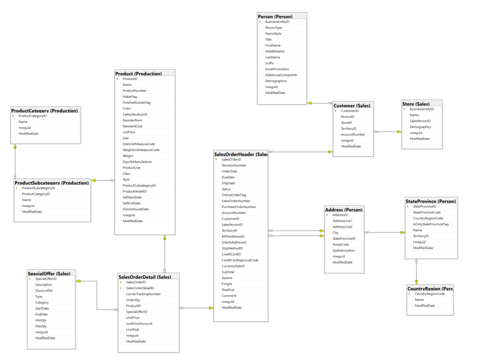

# About
This project is to create dimensional models (Kimball approach) for AdventureWorks2019 OLTP database. The models represent some of the business entities like:
- Sales Process
- Inventory Management
- Purchasing
- Business Processes Monitoring 

Environment Setup:
- dbtCore: for modeling data
- SQL Server on Docker
- SQL Server Management Studio


# Run SQL Server 2019 with Docker
Download SQL Server 2019 image
``` 
docker pull mcr.microsoft.com/mssql/server:2019-latest 
```

Run SQL server 2019 image
``` 
docker run -e "ACCEPT_EULA=Y" -e "MSSQL_SA_PASSWORD=sQLserver@2019" \
--name sql-server-2019-container \
-p 1433:1433 \
-d mcr.microsoft.com/mssql/server:2019-latest

```
# Install SQL Server Management Studio (SSMS)

Download SSMS

Create new connection:
- server: localhost, 1433
- username: SA
- password: sQLserver@2019

# Install ODBC Driver for SQL Server
[download here](https://learn.microsoft.com/en-us/sql/connect/odbc/download-odbc-driver-for-sql-server?view=sql-server-ver15)

# Restore AdventureWorks2019 database
- Download AdventureWorks2019.bak [here](https://learn.microsoft.com/en-us/sql/samples/adventureworks-install-configure?view=sql-server-ver16&tabs=ssms) 

- Copy the downloaded file to Docker container ```sql-server-2019-container```
    + Open terminal in the  directory that store the download AdventureWorks2019.bak
    + Run ```docker ps``` to get the ID of ```sql-server-2019-container```
    + Run ``` cp AdventureWorks2019.bak container_id:/tmp ``` to upload the bak file to Docker 
    + Open SSMS, restore the database, check [instruction](https://learn.microsoft.com/en-us/sql/relational-databases/backup-restore/quickstart-backup-restore-database?view=sql-server-ver16&tabs=ssms)

# Set up dbt

## Install dbt sql-server adaptor

Run this code in terminal

```
python -m pip install dbt-sqlserver 

```

## Setup dbt profile

Check file [profiles.yml](profiles.yml)

## Check dbt setup
 Run in terminal

 ``` 
 dbt debug
 ```

## Install dbt packages:
Run ``` dbt dep ``` to install packages


# Part 1: Dimensional Data Models for Sales Process (dtb practice)

**Problem state:**

Assume CEO of AdventureWorks want to know about the sales process as below:

AdventureWorks manufactures bicycles and sells them to consumers (B2C) and businesses (B2B). The bicycles are shipped to customers from all around the world. As the CEO of the business, I would like to know how much revenue we have generated for the year ending 2011, broken down by:

- Product category and subcategory
- Customer
- Order status
- Shipping country, state, and city

## Source Entity Realationshop Diagram (ERD)

Base on the request above, the dimensional model need to represent the business Sales Process and able to slice and dice data by:
- Product category and subcategory
- Customer
- Order status
- Shipping country, state, and city
- Date (day, month, year)





## Model details:

Fact table:
- fct_sales: join Sales.SalesOrderHeader and Sales.SalesOrderDetail

Dimension tables:
- dim_product: from Production.Product, Production.ProductSubcategory, Production.ProductCategory
- dim_customer: from Sales.Customer, Sales.Store, Person.Person
- dim_date: date-table (from seed) or dbt_date packages (check later to see if it works for SQL SERVER)
- dim_order_status: distinct statuses from SalesOrderHeader
- dim_address: Person.Adress, Person.StateProvince, Person.CountryRegion
- dim_credit_card: from Sales.CreditCard

## Create Dimention Tables

### 1. dim_product

1. Define sources in [dim_product.yml](adventure_works_dbt\models\marts\dim_product.yml)

2. Write sql query in [dim_product.sql](adventure_works_dbt\models\marts\dim_product.sql)
- Use macro sqlserver__generate_surrogate_key instead of dbt_utiles.generate_surrogate_key because of error in SQL Server.

3. Run testing dim_product with

```
dbt run --select dim_product
```

4. Generate YAML for ```dim_product``` 

```
dbt run-operation generate_model_yaml --args '{"model_names": ["dim_product"]}'
```

Then Paste the result to ```dim_product.yml``` to have the schema of the model, the add column's descriptions and tests for the model

5. Build model with tests

```
dbt build --select dim_product
```

## 2. Create the remain dimension tables follow dim_product
- dim_customer
- dim_date
- dim_order_status
- dim_address
- dim_credit_card